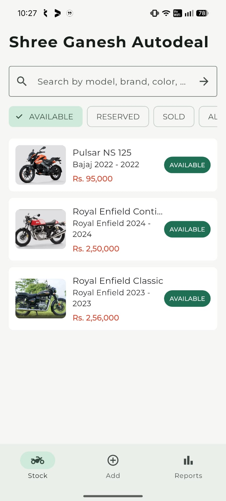
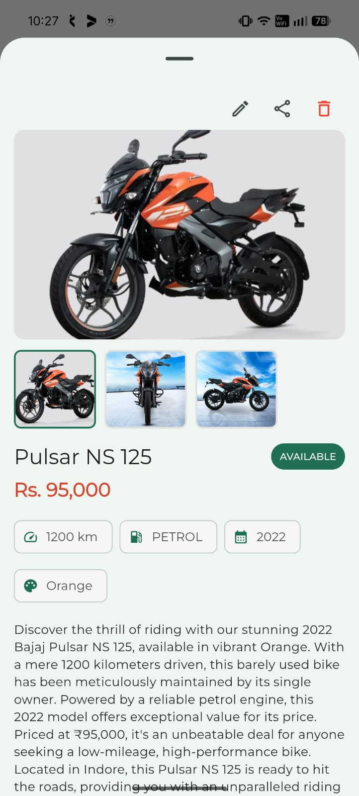
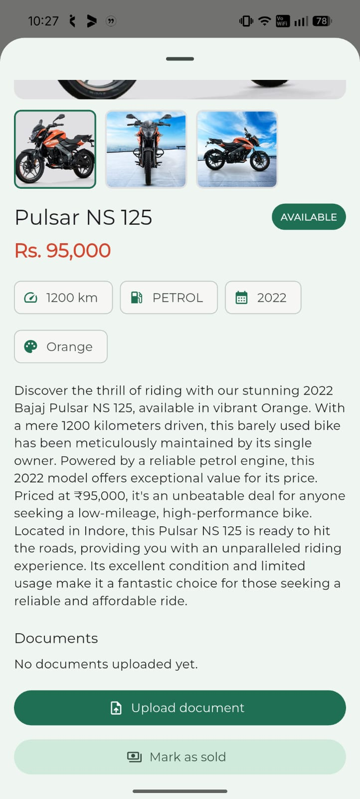
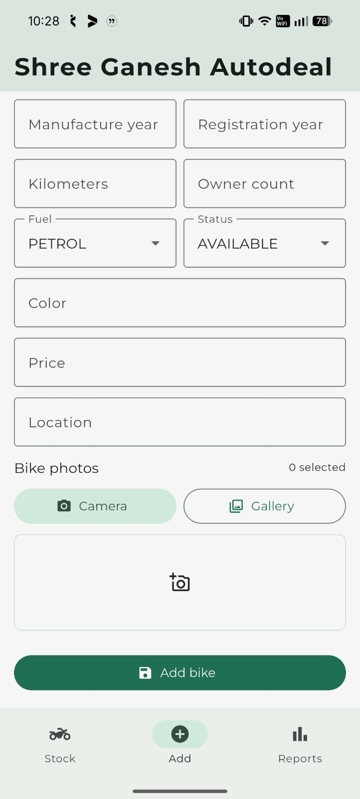
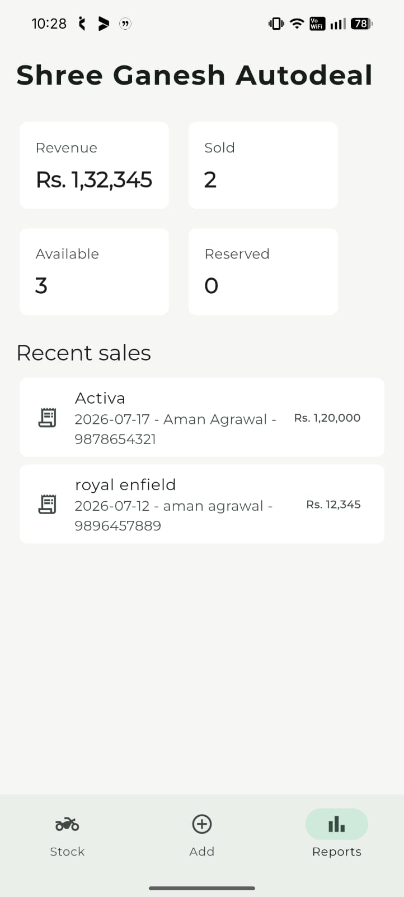

# Shree Ganesh Autodeal

Last updated: July 26, 2026

Shree Ganesh Autodeal is a full-stack two-wheeler dealership platform with a Flutter admin app, a React customer catalog, and a Spring Boot backend. The owner can manage inventory, images, vehicle documents, categories, and sales from the mobile app, while customers can browse available vehicles through the public web catalog.

The backend now includes Redis-backed caching for read-heavy catalog and reporting endpoints, with targeted eviction whenever inventory data changes.

---

## Live Customer Website

[Visit the website](https://autodeal-taupe.vercel.app/)

---

## Current Project Structure

```text
Autodeal/
|-- ShreeGaneshAutodeal-backend/
|   `-- ShreeGaneshAutodeal/       # Spring Boot API
|-- Autodeal-web-app/              # React + Vite customer catalog
|-- mobile-app/                    # Flutter admin application
|-- supabase/
|   `-- schema.sql                 # PostgreSQL schema
|-- screenshots/                   # Mobile app screenshots
`-- README.md
```

---

## Screenshots

<p align="center">
  
  
  
</p>

<p align="center">
  
  
</p>

---

## Features

### Flutter Admin App

- Add, edit, and delete vehicles
- Upload multiple vehicle images
- Upload RC, insurance, invoice, and other documents
- Manage categories
- Mark vehicles as sold
- View sales reports
- Share vehicle details
- Manage inventory from mobile

### React Customer Catalog

- Browse vehicle inventory
- Search vehicles
- Filter by category and status
- View vehicle images and detailed specifications
- Responsive customer-facing layout

### Spring Boot Backend

- REST APIs for admin and public catalog flows
- DTO-first API responses
- Pagination, search, and dynamic filtering
- PostgreSQL persistence through Spring Data JPA
- Supabase Storage integration for vehicle media and documents
- Groq LLM integration for AI-generated vehicle descriptions
- Centralized exception handling
- Redis-backed cache for high-read endpoints
- Comprehensive unit and slice tests with JUnit 5, Mockito, and MockMvc
- Test profile using H2 and no-op cache

---

## Tech Stack

| Layer | Current Stack |
| --- | --- |
| Backend | Java 21, Spring Boot 4.1.0, Spring MVC, Spring Data JPA, Hibernate, Maven |
| Testing | JUnit 5 (Jupiter), Mockito, MockMvc, AssertJ, H2 in-memory DB |
| Cache | Redis through Spring Cache and Spring Data Redis |
| Database | PostgreSQL-compatible schema, H2 for tests |
| Storage | Supabase Storage |
| Web | React 19, Vite 8, TypeScript 6, Tailwind CSS 4 |
| Mobile | Flutter, Dart, Provider, http, image_picker, file_picker |

---

## Architecture

```text
                         React Customer Web App
                                  |
                                  v
                         Public Catalog APIs
                                  |
                                  v
Flutter Admin App --> Spring Boot REST Backend --> PostgreSQL Database
                                  |
                                  +--> Redis Cache
                                  |
                                  +--> Supabase Storage
                                  |
                                  +--> Groq LLM API
```

Redis is used only as a cache layer. PostgreSQL remains the source of truth.

---

## Redis Implementation

The Spring Boot backend uses Redis through Spring Cache.

### Cache Coverage

| Cache | API / Service Path | TTL | Evicted When |
| --- | --- | ---: | --- |
| `categories` | Category list | 30 min | Category create, update, delete |
| `vehicle-searches` | Paginated vehicle search/listing | 2 min | Vehicle/category mutations, image upload, mark sold |
| `public-vehicle-details` | Public vehicle detail | 5 min | Vehicle update/delete, image upload, mark sold |
| `admin-vehicle-details` | Admin vehicle detail with private data | 2 min | Vehicle/document/category mutations |
| `vehicle-images` | Vehicle image list | 5 min | Vehicle update/delete, image upload |
| `vehicle-documents` | Vehicle document list | 5 min | Document upload/delete, vehicle delete |
| `sales-reports` | Sales report dashboard | 1 min | Vehicle create/update/delete, mark sold |

### Cache Safety

- Cache keys are deterministic for paginated vehicle filters.
- Response DTOs are serializable, so Redis stores API-safe payloads instead of JPA entities.
- Mutations evict related cache entries to avoid stale inventory data.
- Redis errors fail open: the API falls back to database reads and logs cache failures instead of failing the request.
- Tests use `spring.cache.type=none`, so CI/local tests do not require Redis.

### Redis Environment Variables

```env
CACHE_TYPE=redis
REDIS_HOST=localhost
REDIS_PORT=6379
REDIS_PASSWORD=
REDIS_TIMEOUT=2s
```

To run Redis locally:

```bash
docker run --name autodeal-redis -p 6379:6379 -d redis:7-alpine
```

To run the backend without Redis during development:

```env
CACHE_TYPE=simple
```

---

## Redis Impact Analysis

These numbers are based on the repository/service query paths in the current backend. Actual latency will depend on deployment, network distance, database size, and Redis placement.

| Endpoint | Before Redis | Warm Redis Hit | Query Reduction |
| --- | ---: | ---: | ---: |
| `GET /api/catalog/categories` | 1 category query | 0 DB queries | 100% per hit |
| `GET /api/catalog/vehicles?page=0&size=24` | About 2 DB queries: page select + count | 0 DB queries | 100% per hit |
| `GET /api/catalog/vehicles/{id}` | About 3 DB queries: vehicle, category, images | 0 DB queries | 100% per hit |
| `GET /api/admin/vehicles/{id}` | About 5 DB queries: vehicle, category, images, documents, sales | 0 DB queries | 100% per hit |
| `GET /api/admin/sales/report` | About 4 DB queries: sales rows + 3 status counts | 0 DB queries | 100% per hit |

Example repeated-load impact inside a TTL window:

| Scenario | Without Redis | With Redis | Reduction |
| --- | ---: | ---: | ---: |
| 1,000 identical catalog page requests | About 2,000 DB queries | About 2 DB queries after first cache fill | About 99.9% |
| 1,000 identical public detail requests | About 3,000 DB queries | About 3 DB queries after first cache fill | About 99.9% |
| 1,000 identical sales report requests | About 4,000 DB queries | About 4 DB queries after first cache fill | About 99.9% |

Resume-ready bullet:

> Integrated Redis-backed caching in a Spring Boot 4 backend for catalog, vehicle detail, media, and sales report APIs with deterministic cache keys, TTL-based policies, targeted eviction, and fail-open error handling, reducing repeated read-query load by about 99.9% within cache TTL windows.

---

## Backend Environment Variables

```env
PORT=8080
DB_URL=
DB_USERNAME=
DB_PASSWORD=
JPA_DDL_AUTO=update
CORS_ALLOWED_ORIGINS=

SUPABASE_URL=
SUPABASE_SERVICE_ROLE_KEY=
SUPABASE_STORAGE_BUCKET=

GROQ_API_KEY=
GROQ_API_URL=
GROQ_MODEL=

CACHE_TYPE=redis
REDIS_HOST=localhost
REDIS_PORT=6379
REDIS_PASSWORD=
REDIS_TIMEOUT=2s
```

Note: the backend defaults to `PORT=8080`, while the web app currently defaults to `http://localhost:9090` if `VITE_API_BASE_URL` is not set. Keep them aligned by either setting `PORT=9090` for local backend runs or setting `VITE_API_BASE_URL=http://localhost:8080`.

---

## API Overview

### Public Catalog

```text
GET /api/catalog/categories
GET /api/catalog/vehicles
GET /api/catalog/vehicles/{id}
```

### Admin

```text
GET    /api/admin/categories
POST   /api/admin/categories
PUT    /api/admin/categories/{id}
DELETE /api/admin/categories/{id}

GET    /api/admin/vehicles
POST   /api/admin/vehicles
GET    /api/admin/vehicles/{id}
PUT    /api/admin/vehicles/{id}
DELETE /api/admin/vehicles/{id}

POST   /api/admin/vehicles/{id}/images
GET    /api/admin/vehicles/{id}/images

POST   /api/admin/vehicles/{id}/documents
GET    /api/admin/vehicles/{id}/documents
DELETE /api/admin/documents/{id}

POST   /api/admin/vehicles/{id}/sales
GET    /api/admin/sales/report
```

---

## Run Locally

### Backend

```bash
cd ShreeGaneshAutodeal-backend/ShreeGaneshAutodeal
./mvnw spring-boot:run
```

On Windows PowerShell:

```powershell
cd ShreeGaneshAutodeal-backend\ShreeGaneshAutodeal
.\mvnw.cmd spring-boot:run
```

### React Web App

```bash
cd Autodeal-web-app
npm install
npm run dev
```

### Flutter Mobile App

```bash
cd mobile-app
flutter pub get
flutter run
```

---

## Verification

### Running Backend Unit Tests

```powershell
cd ShreeGaneshAutodeal-backend\ShreeGaneshAutodeal
.\mvnw.cmd test
```

### Test Suite Breakdown

| Test Suite | Focus / Layer | Framework / Tools |
| --- | --- | --- |
| `CategoryServiceTest` | Category CRUD, slug generation, name/slug uniqueness, string normalization | JUnit 5, Mockito |
| `VehicleServiceTest` | Vehicle lifecycle, search pagination, private data isolation, image/document management, sales report | JUnit 5, Mockito |
| `SupabaseStorageServiceTest` | File type validation, null/empty file guards, storage configuration guards | JUnit 5, Mockito |
| `AdminControllerTest` | Admin REST APIs for categories, vehicles, multipart document/image uploads, sales | MockMvc, Mockito |
| `CatalogControllerTest` | Public REST catalog endpoints, filtered vehicle searches, details | MockMvc, Mockito |
| `GlobalExceptionHandlerTest` | Global error translation (404, 400, 413) and validation error maps | JUnit 5 |
| `VehicleSpecificationsTest` | Dynamic JPA Specifications matching (search, slug, status, price range) | Spring Boot Test, H2 |
| `SupabasePropertiesTest` | Supabase property configuration state verification | JUnit 5 |
| `CacheKeysTests` | Deterministic cache key generation for Redis | JUnit 5 |
| `ShreeGaneshAutodealApplicationTests` | Spring Boot context load sanity check | Spring Boot Test |

Latest verification result:

```text
Tests run: 80, Failures: 0, Errors: 0, Skipped: 0
BUILD SUCCESS
```

---

## Database Model

```text
categories
    |
    v
vehicles
    |-- vehicle_images
    |-- vehicle_documents
    `-- sale_records
```

Important indexes in `supabase/schema.sql`:

- `idx_vehicles_status`
- `idx_vehicles_category`
- `idx_vehicles_brand_model`
- `idx_sale_records_sale_date`

---

## Future Enhancements

- JWT authentication and role-based access control
- Customer accounts, favorites, and test-ride bookings
- Payment gateway integration
- Analytics dashboard
- Docker Compose for backend, PostgreSQL, and Redis
- CI/CD pipeline
- Production observability for cache hit ratio and Redis latency
