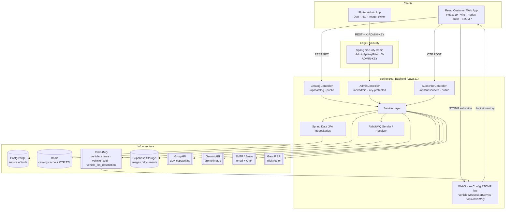
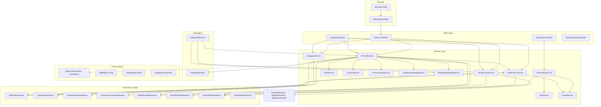
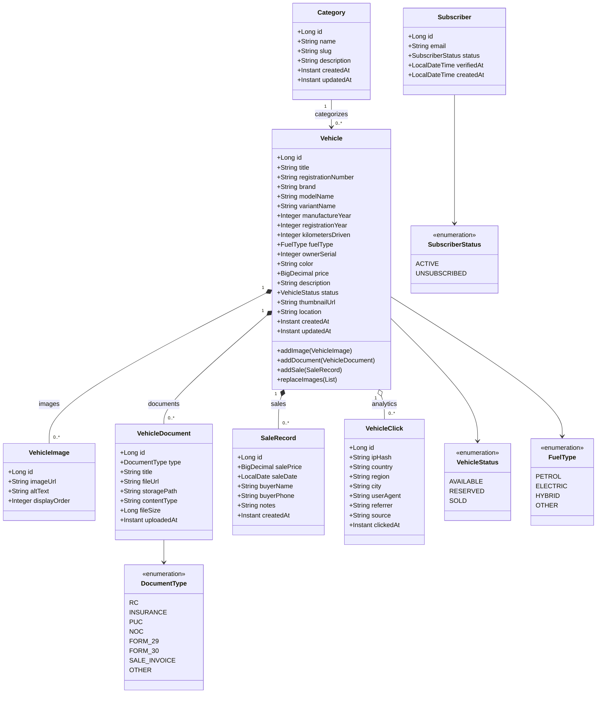
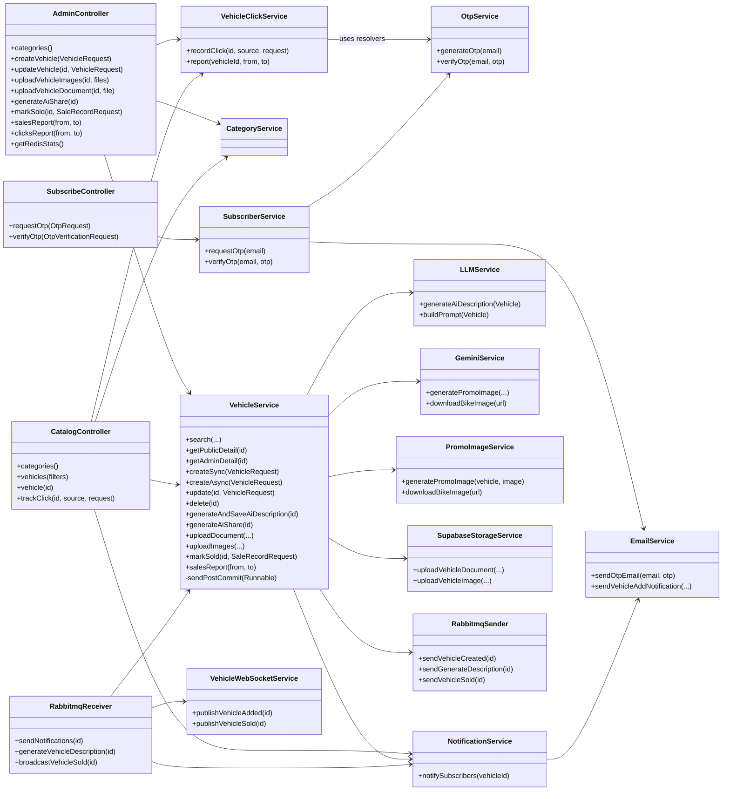
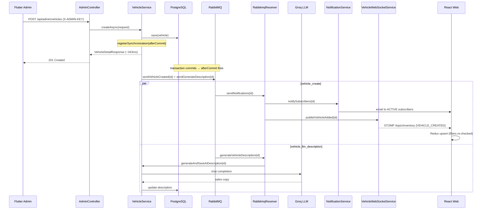
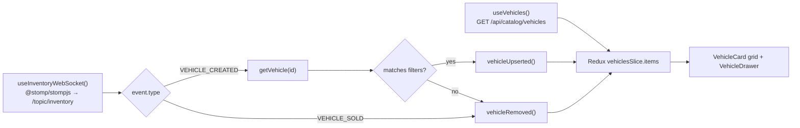
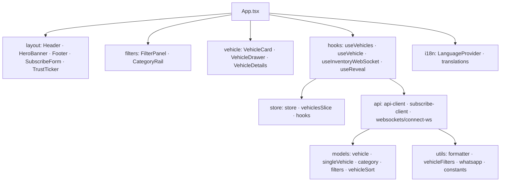
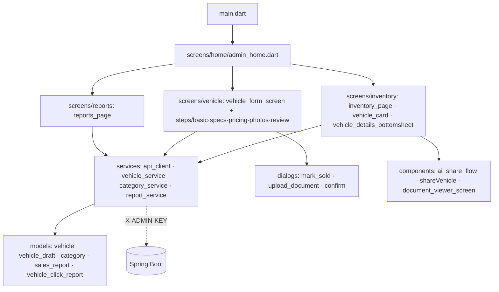
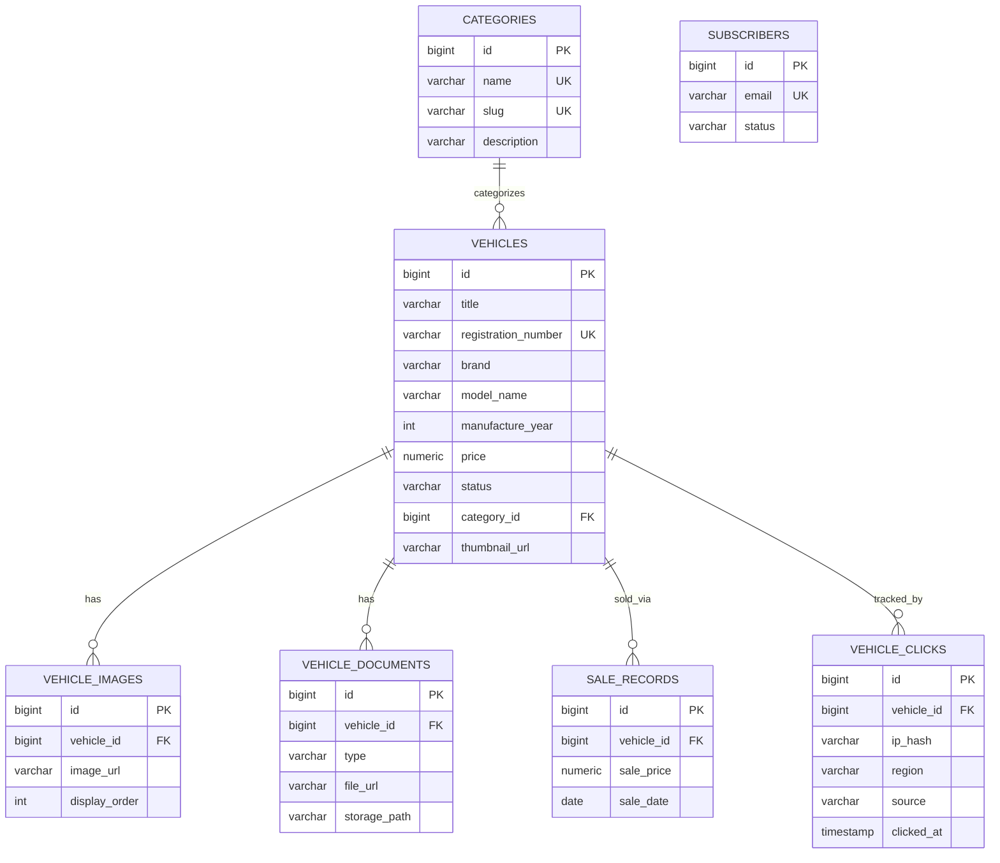

# Shree Ganesh Autodeal — Architecture & UML

Full-stack two-wheeler dealership platform composed of three tiers:

- **Flutter Admin App** (`mobile-app/`) — owner inventory, documents, reports
- **React Customer Catalog** (`Autodeal-web-app/`) — public vehicle browsing
- **Spring Boot Backend** (`ShreeGaneshAutodeal-backend/`) — REST API, messaging, real-time

Supporting infrastructure: PostgreSQL, Redis, RabbitMQ, Supabase Storage, Groq LLM + Gemini, SMTP/Brevo.

> All diagrams are written in **Mermaid** and render on GitHub, GitLab, and VS Code (Markdown Preview Mermaid Support).

---

## 1. System Architecture (Context / Deployment)

---

## 2. Backend Layered Architecture

---

## 3. UML Class Diagram — Domain Model

---

## 4. UML Class Diagram — Controllers & Services

---

## 5. Sequence — Async Vehicle Creation + Real-Time Broadcast

**Mark-as-sold** mirrors this: `markSold → afterCommit → vehicle_sold queue → publishVehicleSold → VEHICLE_SOLD → Redux removes item`.

---

## 6. Real-Time Inventory State Flow (React)

---

## 7. Frontend Module Architecture

### React Web App (`Autodeal-web-app/src`)

### Flutter Admin App (`mobile-app/lib`)

---

## 8. Entity-Relationship (Data Model)

---

## 9. Key Architectural Decisions

- **Single Spring Boot backend, two client classes.** Key-protected admin CRUD (Flutter) and public read-heavy catalog (React). The split is enforced in `SecurityConfig` + `AdminApiKeyFilter`: `/api/catalog/**` and `/api/subscribers/**` are `permitAll`, `/api/admin/**` is `authenticated`.
- **Transactional post-commit dispatch.** `TransactionSynchronizationManager.afterCommit()` ensures RabbitMQ messages publish only after the DB transaction commits, eliminating race conditions between the database and consumers.
- **RabbitMQ fan-out.** Slow external I/O (subscriber email, Groq LLM description) is offloaded from the request thread (~9.6x faster vehicle creation) and also drives WebSocket inventory events.
- **Redis.** Fail-open response cache (7 named caches with TTL + targeted eviction) plus short-lived OTP storage (5-minute TTL).
- **PostgreSQL is the source of truth**; Supabase Storage holds vehicle media and documents.
- **React state.** Redux stores inventory; REST hydrates it and STOMP patches it via `vehicleUpserted` / `vehicleRemoved`.
- **Newer modules (beyond README).** Vehicle-click analytics (`VehicleClick`, `RegionResolver`, `ClientIpResolver`, `IpAddressHasher`) and AI promo-image sharing (`GeminiService` / `PromoImageService`, `AiShareResponse`).

---

## Queue Reference

| Queue | Producer | Consumer | Purpose |
| --- | --- | --- | --- |
| `vehicle_create` | `RabbitmqSender.sendVehicleCreated` | `RabbitmqReceiver.sendNotifications` | Email new inventory to active subscribers + broadcast `VEHICLE_CREATED` |
| `vehicle_sold` | `RabbitmqSender.sendVehicleSold` | `RabbitmqReceiver.broadcastVehicleSold` | Broadcast `VEHICLE_SOLD` to web clients |
| `vehicle_llm_description` | `RabbitmqSender.sendGenerateDescription` | `RabbitmqReceiver.generateVehicleDescription` | Generate + persist Groq LLM sales copy |

## Cache Reference

| Cache | TTL | Evicted When |
| --- | ---: | --- |
| `categories` | 30 min | Category create/update/delete |
| `vehicle-searches` | 2 min | Vehicle/category mutations, image upload, mark sold |
| `public-vehicle-details` | 5 min | Vehicle update/delete, image upload, mark sold |
| `admin-vehicle-details` | 2 min | Vehicle/document/category mutations |
| `vehicle-images` | 5 min | Vehicle update/delete, image upload |
| `vehicle-documents` | 5 min | Document upload/delete, vehicle delete |
| `sales-reports` | 1 min | Vehicle create/update/delete, mark sold |
